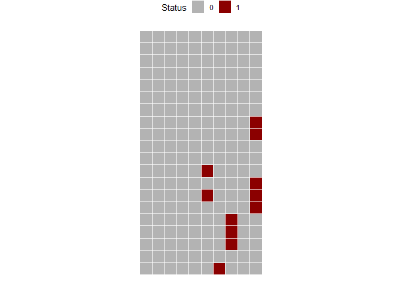
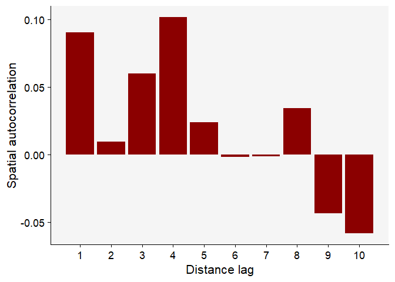

Spatial autocorrelation analysis for the GRBV data
================

- [Load libraries](#load-libraries)
- [Import the data from a csv file](#import-the-data-from-a-csv-file)
- [Plot the data](#plot-the-data)
- [Joint count test statistics](#joint-count-test-statistics)
- [Moran’s I test statistics](#morans-i-test-statistics)
- [Moran’s I test](#morans-i-test)
- [Spatial correlogram](#spatial-correlogram)
- [Software version](#software-version)

## Load libraries

``` r
library(tidyverse) 
library(r4pde) 
library(raster)
library(spdep)
```

## Import the data from a csv file

``` r
data <- read.csv("data.csv", row.names = 1)
head(data)
```

    ##        Row.1 Row.2 Row.3 Row.4 Row.5 Row.6 Row.7 Row.8 Row.9 Row.10
    ## Vine 1     0     0     0     0     0     0     0     0     0      0
    ## Vine 2     0     0     0     0     0     0     0     0     0      0
    ## Vine 3     0     0     0     0     0     0     0     0     0      0
    ## Vine 4     0     0     0     0     0     0     0     0     0      0
    ## Vine 5     0     0     0     0     0     0     0     0     0      0
    ## Vine 6     0     0     0     0     0     0     0     0     0      0

## Plot the data

``` r
data_matrix <- as.matrix(data)

# Convert to raster 
mapS2 <- terra::rast(matrix(data_matrix, nrow(data_matrix), ncol(data_matrix), byrow = FALSE))
# Convert to data frame
mapS3 <- terra::as.data.frame(mapS2, xy = TRUE)
mapS3 |>
  ggplot(aes(x, y, label = lyr.1, fill = factor(lyr.1))) +
  geom_tile(color = "white", linewidth = 0.5) +
  theme_void() +
  coord_fixed()+
  labs(fill = "Status") +
  scale_fill_manual(values = c("gray70", "darkred"))+
  theme(legend.position = "top")
```

<!-- -->

## Joint count test statistics

``` r
join_count(data_matrix)
```

    ## Join Count Analysis of Spatial Patterns of Plant Diseases:
    ##  ----------------------------------------------------------
    ##  1) 'HD' Sequences:
    ##     - Observed Count: 28
    ##     - Expected Count : 38.46
    ##     - Standard Deviation: 10.90
    ##     - Z-score: -1.01
    ##  The pattern for 'HD' sequences is 'not aggregated'.
    ## 
    ##  2) 'DD' Sequences:
    ##     - Observed Count: 5
    ##     - Expected Count: 1.12
    ##     - Standard Deviation: 1.20
    ##     - Z-score: 3.65
    ##  The pattern for 'DD' sequences is 'aggregated'.
    ##  ----------------------------------------------------------

- HD sequences are not aggregated but DD sequences are
- Interpretation:
  - If HD sequences are not aggregated, it means that the observed
    number of HD sequences is not significantly different from the
    expected number under a random distribution. This implies that there
    is no spatial pattern or association between diseased and healthy
    grids.
  - If DD sequences are aggregated, it means that the observed number of
    DD sequences is significantly greater than the expected number under
    a random distribution. This implies that there is positive spatial
    autocorrelation or clustering of diseased grids.
  - One possible interpretation of this result is that the disease is
    spreading locally among neighboring cells, but not across the whole
    grid.
  - OR, Another possible interpretation is that there are environmental
    or genetic factors that make some cells more susceptible to the
    disease than others, and these factors are spatially correlated.

## Moran’s I test statistics

``` r
set.seed(100)

nb <- cell2nb(nrow(data_matrix), ncol(data_matrix), type = "queen", torus = FALSE)

col.W <- nb2listw(nb, style = "W")
moran(x = data_matrix, # numeric vector
      listw = col.W, # the nb list
      n = nrow(data_matrix), # number of zones
      S0 = Szero(col.W)) # global sum of weights
```

    ## $I
    ## [1] 0.009060045
    ## 
    ## $K
    ## [1] 16.24002

## Moran’s I test

``` r
moran.test(x = data_matrix, 
           listw = col.W)
```

    ## 
    ##  Moran I test under randomisation
    ## 
    ## data:  data_matrix  
    ## weights: col.W    
    ## 
    ## Moran I statistic standard deviate = 2.6408, p-value = 0.004136
    ## alternative hypothesis: greater
    ## sample estimates:
    ## Moran I statistic       Expectation          Variance 
    ##       0.090600449      -0.005025126       0.001311272

- This shows significant positive Moran’s I test statistics (p-value \<
  0.05), indicating that the observations are spatially autocorrelated.
- The disease incidence tend to be similar for nearby locations,
  indicating a clustered or aggregated pattern.

## Spatial correlogram

``` r
correl_I <- sp.correlogram(nb, as.vector(data_matrix), 
                           order = 10,
                           method = "I",  
                           zero.policy = TRUE)

df_correl <- data.frame(correl_I$res) |> 
  mutate(lag = c(1:10))
# Show the spatial autocorrelation for 10 distance lags
round(df_correl$X1,3)
```

    ##  [1]  0.091  0.010  0.060  0.102  0.024 -0.002 -0.001  0.034 -0.043 -0.058

``` r
df_correl |>
  ggplot(aes(lag, X1)) +
  geom_col(fill = "darkred") +
  theme_r4pde()+
  scale_x_continuous(n.breaks = 10) +
  labs(x = "Distance lag", y = "Spatial autocorrelation")
```

<!-- -->

## Software version

``` r
sessionInfo()
```

    ## R version 4.2.2 (2022-10-31 ucrt)
    ## Platform: x86_64-w64-mingw32/x64 (64-bit)
    ## Running under: Windows 10 x64 (build 19045)
    ## 
    ## Matrix products: default
    ## 
    ## locale:
    ## [1] LC_COLLATE=English_Australia.utf8  LC_CTYPE=English_Australia.utf8   
    ## [3] LC_MONETARY=English_Australia.utf8 LC_NUMERIC=C                      
    ## [5] LC_TIME=English_Australia.utf8    
    ## 
    ## attached base packages:
    ## [1] stats     graphics  grDevices utils     datasets  methods   base     
    ## 
    ## other attached packages:
    ##  [1] spdep_1.3-1      sf_1.0-14        spData_2.3.0     raster_3.6-26   
    ##  [5] sp_2.1-1         r4pde_0.0.0.9000 lubridate_1.9.3  forcats_1.0.0   
    ##  [9] stringr_1.5.0    dplyr_1.1.3      purrr_1.0.2      readr_2.1.4     
    ## [13] tidyr_1.3.0      tibble_3.2.1     ggplot2_3.4.4    tidyverse_2.0.0 
    ## 
    ## loaded via a namespace (and not attached):
    ##  [1] Rcpp_1.0.11        perm_1.0-0.4       lattice_0.20-45    deldir_2.0-2      
    ##  [5] class_7.3-20       digest_0.6.33      utf8_1.2.3         R6_2.5.1          
    ##  [9] evaluate_0.22      e1071_1.7-13       pillar_1.9.0       rlang_1.1.1       
    ## [13] rstudioapi_0.15.0  Matrix_1.6-1.1     rmarkdown_2.25     labeling_0.4.3    
    ## [17] MLEcens_0.1-7      splines_4.2.2      igraph_1.6.0       munsell_0.5.0     
    ## [21] proxy_0.4-27       compiler_4.2.2     xfun_0.40          pkgconfig_2.0.3   
    ## [25] htmltools_0.5.6.1  tidyselect_1.2.0   codetools_0.2-18   fansi_1.0.5       
    ## [29] tzdb_0.4.0         withr_3.0.0        wk_0.9.0           grid_4.2.2        
    ## [33] gtable_0.3.4       lifecycle_1.0.4    DBI_1.1.3          magrittr_2.0.3    
    ## [37] units_0.8-4        scales_1.3.0       KernSmooth_2.23-20 cli_3.6.1         
    ## [41] stringi_1.7.12     farver_2.1.1       interval_1.1-1.0   generics_0.1.3    
    ## [45] vctrs_0.6.4        cowplot_1.1.1      boot_1.3-28        s2_1.1.4          
    ## [49] tools_4.2.2        glue_1.6.2         hms_1.1.3          fastmap_1.1.1     
    ## [53] survival_3.4-0     yaml_2.3.7         timechange_0.2.0   colorspace_2.1-0  
    ## [57] terra_1.7-55       Icens_1.70.0       classInt_0.4-10    knitr_1.44
