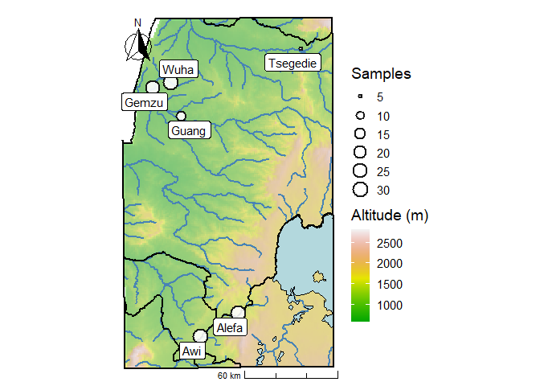

Plotting sample sites: Metema and Metekel
================

- [Load required packages](#load-required-packages)
- [Get data](#get-data)
- [Create topographical map with
  rivers](#create-topographical-map-with-rivers)
- [Calculate hillshade](#calculate-hillshade)
- [Plotting using ggplot 2](#plotting-using-ggplot-2)
- [Save the plot](#save-the-plot)
- [Session info](#session-info)

## Load required packages

``` r
library(sf)
library(raster)
library(ggplot2)
library(ggspatial)
library(ggrepel)
library(dplyr)
```

## Get data

``` r
load("../data/metema_output_GIS.RData")
eth_st <- getData(name = "GADM", country = "ETH", level = 2)  # level 2 for migration map
```

    ## Warning in getData(name = "GADM", country = "ETH", level = 2): getData will be removed in a future version of raster
    ## . Please use the geodata package instead

``` r
eth <- eth_st %>% st_as_sf()
```

## Create topographical map with rivers

``` r
river_line_eth <- st_read("../data/DIVA_gis/ETH_wat/ETH_water_lines_dcw.shp") %>% st_as_sf()
```

    ## Reading layer `ETH_water_lines_dcw' from data source 
    ##   `C:\Users\HIMALS\Downloads\metema-radseq-plotting\data\DIVA_gis\ETH_wat\ETH_water_lines_dcw.shp' 
    ##   using driver `ESRI Shapefile'
    ## Simple feature collection with 4070 features and 5 fields
    ## Geometry type: MULTILINESTRING
    ## Dimension:     XY
    ## Bounding box:  xmin: 33.00001 ymin: 3.516662 xmax: 47.49334 ymax: 14.89166
    ## Geodetic CRS:  WGS 84

``` r
bbox_buffer_wgs84 <- bbox_buffer_sf %>% st_transform(crs = "+init=epsg:4326")
```

    ## Warning in CPL_crs_from_input(x): GDAL Message 1: +init=epsg:XXXX syntax is
    ## deprecated. It might return a CRS with a non-EPSG compliant axis order.

``` r
river_line_eth_crop_wgs84 <- st_intersection(river_line_eth, bbox_buffer_wgs84)
```

    ## Warning: attribute variables are assumed to be spatially constant throughout
    ## all geometries

``` r
water_areas <- water_areas %>% st_transform(crs = "+init=epsg:4326")
```

``` r
populations_wgs84 <- populations_utm %>% st_as_sf() %>% st_transform(crs = "+init=epsg:4326")
bbox_eth_wgs84 <- bbox_eth_sp %>% st_as_sf() %>% st_transform(crs = "+init=epsg:4326")
```

## Calculate hillshade

``` r
alt_r <- getData('alt', country='ETH')
```

    ## Warning in getData("alt", country = "ETH"): getData will be removed in a future version of raster
    ## . Please use the geodata package instead

``` r
alt <- trim(mask(alt_r, bbox_eth_wgs84))
slope <- raster::terrain(alt, opt='slope')
aspect <- terrain(alt, opt='aspect')

hill <- hillShade(slope, aspect, 40, 270)
```

## Plotting using ggplot 2

### Preparing data

``` r
hs <-  hill
dem <- alt
#   Convert rasters TO dataframes for plotting with ggplot
hdf <- rasterToPoints(hs); hdf <- data.frame(hdf)
colnames(hdf) <- c("X","Y","Hill")
ddf <- rasterToPoints(dem); ddf <- data.frame(ddf)
colnames(ddf) <- c("X","Y","DEM")

#   Create vectors for colour breaks
b.hs <- seq(min(hdf$Hill),max(hdf$Hill),length.out=100)
b.dem <- seq(min(ddf$DEM),max(ddf$DEM),length.out=100)

populations_wgs84$sample_size <- c(31, 31, 12, 26, 29, 5) ## adding sample size information
populations_df <- data.frame(populations_wgs84)
populations_df <- cbind(populations_df, st_coordinates(populations_wgs84))
bbox_eth_district <- st_intersection(bbox_buffer_wgs84, eth)
```

    ## Warning: attribute variables are assumed to be spatially constant throughout
    ## all geometries

### Plotting

``` r
p <- ggplot() + 
  geom_raster(data = ddf, aes(X, Y, fill = DEM, alpha = 2)) +
  geom_raster(data = hdf, aes(X, Y, alpha = Hill)) +
  scale_fill_gradientn(name="Altitude (m)",colours = terrain.colors(20))+
  guides(fill = guide_colorbar()) +
  scale_alpha(range = c(0, 0.5), guide = "none") +
  coord_equal() + theme_void()


## Boundary
p1 <- p + 
  # geom_sf(data = bbox_eth_wgs84, col = "black", lwd = 1, lty = 1, alpha = 0.01) +
  geom_sf(data = river_line_eth_crop_wgs84, col = "steelblue", lwd = 0.8) +
  geom_sf(data = water_areas, fill = "lightblue", col = "black", alpha = .9) +
  geom_sf(data = bbox_eth_district, col = "black", lwd = .85, lty = 1, alpha = 0.01)
```

    ## Coordinate system already present. Adding new coordinate system, which will
    ## replace the existing one.

``` r
scale_bar <- p1 +
annotation_scale(location = "br", width_hint = 0.5, style = 'ticks')

direction <- scale_bar +
  annotation_north_arrow(location = "tl", which_north = "true",
        pad_x = unit(0.05, "in"), pad_y = unit(0.25, "in"),
        style = north_arrow_fancy_orienteering)


p3 <- direction + geom_point(data = populations_df, aes(X, Y, size = sample_size),shape = 21,  fill = "white", alpha = .9, colour = "black", stroke = 1.25) +
  geom_label_repel(data = populations_df, aes(X, Y, label = location), size = 4, alpha = 1) + theme_void(base_size = 14)

p3$labels$size <- "Samples" 

p3
```

<!-- -->

## Save the plot

``` r
ggsave(plot = p3, filename = "../figs/221213_sample_locations_vec_par.png", device = "png", dpi = 500, width = 5.5, height = 6, units = "in", bg = 'white')
```

## Session info

``` r
sessionInfo()
```

    ## R version 4.2.2 (2022-10-31 ucrt)
    ## Platform: x86_64-w64-mingw32/x64 (64-bit)
    ## Running under: Windows 10 x64 (build 19045)
    ## 
    ## Matrix products: default
    ## 
    ## locale:
    ## [1] LC_COLLATE=English_Australia.utf8  LC_CTYPE=English_Australia.utf8   
    ## [3] LC_MONETARY=English_Australia.utf8 LC_NUMERIC=C                      
    ## [5] LC_TIME=English_Australia.utf8    
    ## 
    ## attached base packages:
    ## [1] stats     graphics  grDevices utils     datasets  methods   base     
    ## 
    ## other attached packages:
    ## [1] dplyr_1.1.3     ggrepel_0.9.4   ggspatial_1.1.9 ggplot2_3.4.4  
    ## [5] raster_3.6-26   sp_2.1-1        sf_1.0-14      
    ## 
    ## loaded via a namespace (and not attached):
    ##  [1] Rcpp_1.0.11        compiler_4.2.2     pillar_1.9.0       class_7.3-20      
    ##  [5] tools_4.2.2        digest_0.6.33      gtable_0.3.4       evaluate_0.22     
    ##  [9] lifecycle_1.0.3    tibble_3.2.1       lattice_0.20-45    pkgconfig_2.0.3   
    ## [13] rlang_1.1.1        DBI_1.1.3          cli_3.6.1          rstudioapi_0.15.0 
    ## [17] yaml_2.3.7         xfun_0.40          fastmap_1.1.1      e1071_1.7-13      
    ## [21] terra_1.7-55       s2_1.1.4           withr_2.5.1        knitr_1.44        
    ## [25] systemfonts_1.0.5  generics_0.1.3     vctrs_0.6.4        classInt_0.4-10   
    ## [29] grid_4.2.2         tidyselect_1.2.0   glue_1.6.2         R6_2.5.1          
    ## [33] textshaping_0.3.7  fansi_1.0.5        rmarkdown_2.25     farver_2.1.1      
    ## [37] magrittr_2.0.3     scales_1.2.1       codetools_0.2-18   htmltools_0.5.6.1 
    ## [41] units_0.8-4        colorspace_2.1-0   ragg_1.2.6         labeling_0.4.3    
    ## [45] KernSmooth_2.23-20 utf8_1.2.3         proxy_0.4-27       wk_0.9.0          
    ## [49] munsell_0.5.0
