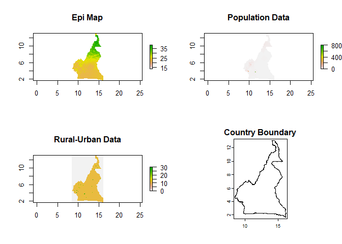
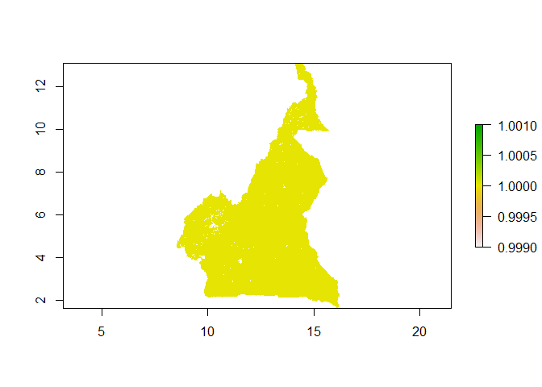
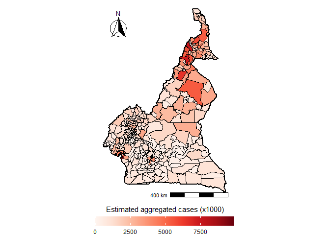

Case Estimates
================

- [Load libraries](#load-libraries)
- [Set the output directory for downloaded
  data](#set-the-output-directory-for-downloaded-data)
- [Load the epi map, population data, and rural-urban
  data](#load-the-epi-map-population-data-and-rural-urban-data)
- [Sanity check](#sanity-check)
- [Exclude urban areas](#exclude-urban-areas)
- [Get population data without urban
  areas](#get-population-data-without-urban-areas)
- [Calculate mean cases by district](#calculate-mean-cases-by-district)
- [Plot aggregated cases](#plot-aggregated-cases)
- [Session info](#session-info)

## Load libraries

``` r
library(raster)
library(sf)
library(exactextractr)
library(geodata)
library(ggplot2)
library(RColorBrewer)
library(ggspatial)
```

## Set the output directory for downloaded data

``` r
output_dir <- getwd()
country_boundary <- gadm("CMR", level = 0, path = output_dir) 
country_boundary_sf <- country_boundary %>% st_as_sf()
country_boundary_3 <- gadm("CMR", level = 3, path = output_dir) 
country_boundary_3_sf <- country_boundary_3 %>% st_as_sf()
```

## Load the epi map, population data, and rural-urban data

``` r
epi_map <- raster("data/day_temp_cameroon_2010_12_1km.tif") # dummy data as example, need to input prevalence map here
pop_count <- raster("data/Pop_count_cameroon_2010_12_1km.tif")
rur_urb_data <- raster("data/2024-01-26_rural_urban_Cameroon_2010_1km.tif")
```

## Sanity check

``` r
par(mfrow = c(2, 2))
plot(epi_map, main = "Epi Map")
plot(pop_count, main = "Population Data")
plot(rur_urb_data, main = "Rural-Urban Data")
plot(country_boundary, main = "Country Boundary")
```

<!-- -->

``` r
par(mfrow = c(1, 1))
```

## Exclude urban areas

``` r
# Reclassify the rural-urban data raster (rur_urb_data) into a new raster (rururb_nourban).
# In the new raster, values less than 1 and values 20 or greater are set to NA (representing negative (invalid) areas and urban areas, respectively),
# and all other values are set to 1 (representing rural and non-urban areas).

rururb_nourban <- reclassify(rur_urb_data, c(-Inf, 1, NA,
                    1, 10, 1,
                    10, 20, 1,
                    20, Inf, NA))
plot(rururb_nourban)
```

<!-- -->

## Get population data without urban areas

``` r
pop_count_rururb_nourban <- pop_count * rururb_nourban

## number of cases - assuming epimap is prevalence in percent
n_cases <- pop_count_rururb_nourban * epi_map
```

## Calculate mean cases by district

``` r
cases <- exactextractr::exact_extract(n_cases, country_boundary_3_sf, fun = "sum")
```

    ##   |                                                                              |                                                                      |   0%  |                                                                              |                                                                      |   1%  |                                                                              |=                                                                     |   1%  |                                                                              |=                                                                     |   2%  |                                                                              |==                                                                    |   2%  |                                                                              |==                                                                    |   3%  |                                                                              |===                                                                   |   4%  |                                                                              |===                                                                   |   5%  |                                                                              |====                                                                  |   5%  |                                                                              |====                                                                  |   6%  |                                                                              |=====                                                                 |   7%  |                                                                              |=====                                                                 |   8%  |                                                                              |======                                                                |   8%  |                                                                              |======                                                                |   9%  |                                                                              |=======                                                               |   9%  |                                                                              |=======                                                               |  10%  |                                                                              |=======                                                               |  11%  |                                                                              |========                                                              |  11%  |                                                                              |========                                                              |  12%  |                                                                              |=========                                                             |  12%  |                                                                              |=========                                                             |  13%  |                                                                              |==========                                                            |  14%  |                                                                              |==========                                                            |  15%  |                                                                              |===========                                                           |  15%  |                                                                              |===========                                                           |  16%  |                                                                              |============                                                          |  17%  |                                                                              |============                                                          |  18%  |                                                                              |=============                                                         |  18%  |                                                                              |=============                                                         |  19%  |                                                                              |==============                                                        |  19%  |                                                                              |==============                                                        |  20%  |                                                                              |==============                                                        |  21%  |                                                                              |===============                                                       |  21%  |                                                                              |===============                                                       |  22%  |                                                                              |================                                                      |  22%  |                                                                              |================                                                      |  23%  |                                                                              |=================                                                     |  24%  |                                                                              |=================                                                     |  25%  |                                                                              |==================                                                    |  25%  |                                                                              |==================                                                    |  26%  |                                                                              |===================                                                   |  27%  |                                                                              |===================                                                   |  28%  |                                                                              |====================                                                  |  28%  |                                                                              |====================                                                  |  29%  |                                                                              |=====================                                                 |  29%  |                                                                              |=====================                                                 |  30%  |                                                                              |=====================                                                 |  31%  |                                                                              |======================                                                |  31%  |                                                                              |======================                                                |  32%  |                                                                              |=======================                                               |  32%  |                                                                              |=======================                                               |  33%  |                                                                              |========================                                              |  34%  |                                                                              |========================                                              |  35%  |                                                                              |=========================                                             |  35%  |                                                                              |=========================                                             |  36%  |                                                                              |==========================                                            |  37%  |                                                                              |==========================                                            |  38%  |                                                                              |===========================                                           |  38%  |                                                                              |===========================                                           |  39%  |                                                                              |============================                                          |  39%  |                                                                              |============================                                          |  40%  |                                                                              |============================                                          |  41%  |                                                                              |=============================                                         |  41%  |                                                                              |=============================                                         |  42%  |                                                                              |==============================                                        |  42%  |                                                                              |==============================                                        |  43%  |                                                                              |===============================                                       |  44%  |                                                                              |===============================                                       |  45%  |                                                                              |================================                                      |  45%  |                                                                              |================================                                      |  46%  |                                                                              |=================================                                     |  47%  |                                                                              |=================================                                     |  48%  |                                                                              |==================================                                    |  48%  |                                                                              |==================================                                    |  49%  |                                                                              |===================================                                   |  49%  |                                                                              |===================================                                   |  50%  |                                                                              |===================================                                   |  51%  |                                                                              |====================================                                  |  51%  |                                                                              |====================================                                  |  52%  |                                                                              |=====================================                                 |  52%  |                                                                              |=====================================                                 |  53%  |                                                                              |======================================                                |  54%  |                                                                              |======================================                                |  55%  |                                                                              |=======================================                               |  55%  |                                                                              |=======================================                               |  56%  |                                                                              |========================================                              |  57%  |                                                                              |========================================                              |  58%  |                                                                              |=========================================                             |  58%  |                                                                              |=========================================                             |  59%  |                                                                              |==========================================                            |  59%  |                                                                              |==========================================                            |  60%  |                                                                              |==========================================                            |  61%  |                                                                              |===========================================                           |  61%  |                                                                              |===========================================                           |  62%  |                                                                              |============================================                          |  62%  |                                                                              |============================================                          |  63%  |                                                                              |=============================================                         |  64%  |                                                                              |=============================================                         |  65%  |                                                                              |==============================================                        |  65%  |                                                                              |==============================================                        |  66%  |                                                                              |===============================================                       |  67%  |                                                                              |===============================================                       |  68%  |                                                                              |================================================                      |  68%  |                                                                              |================================================                      |  69%  |                                                                              |=================================================                     |  69%  |                                                                              |=================================================                     |  70%  |                                                                              |=================================================                     |  71%  |                                                                              |==================================================                    |  71%  |                                                                              |==================================================                    |  72%  |                                                                              |===================================================                   |  72%  |                                                                              |===================================================                   |  73%  |                                                                              |====================================================                  |  74%  |                                                                              |====================================================                  |  75%  |                                                                              |=====================================================                 |  75%  |                                                                              |=====================================================                 |  76%  |                                                                              |======================================================                |  77%  |                                                                              |======================================================                |  78%  |                                                                              |=======================================================               |  78%  |                                                                              |=======================================================               |  79%  |                                                                              |========================================================              |  79%  |                                                                              |========================================================              |  80%  |                                                                              |========================================================              |  81%  |                                                                              |=========================================================             |  81%  |                                                                              |=========================================================             |  82%  |                                                                              |==========================================================            |  82%  |                                                                              |==========================================================            |  83%  |                                                                              |===========================================================           |  84%  |                                                                              |===========================================================           |  85%  |                                                                              |============================================================          |  85%  |                                                                              |============================================================          |  86%  |                                                                              |=============================================================         |  87%  |                                                                              |=============================================================         |  88%  |                                                                              |==============================================================        |  88%  |                                                                              |==============================================================        |  89%  |                                                                              |===============================================================       |  89%  |                                                                              |===============================================================       |  90%  |                                                                              |===============================================================       |  91%  |                                                                              |================================================================      |  91%  |                                                                              |================================================================      |  92%  |                                                                              |=================================================================     |  92%  |                                                                              |=================================================================     |  93%  |                                                                              |==================================================================    |  94%  |                                                                              |==================================================================    |  95%  |                                                                              |===================================================================   |  95%  |                                                                              |===================================================================   |  96%  |                                                                              |====================================================================  |  97%  |                                                                              |====================================================================  |  98%  |                                                                              |===================================================================== |  98%  |                                                                              |===================================================================== |  99%  |                                                                              |======================================================================|  99%  |                                                                              |======================================================================| 100%

``` r
country_boundary_3_sf$cases <- cases/1000
```

## Plot aggregated cases

``` r
mypalette <- colorRampPalette((brewer.pal(9, "Reds")))
agg_cases <- ggplot()+
  geom_sf(data = country_boundary_3_sf, aes(fill = cases), col = "black", lwd = .3) +
  geom_sf(data = country_boundary_sf, col = "black", lwd = .8, alpha = 0) + 
  scale_fill_gradientn(colours = mypalette(100)) +
  labs(fill = "Estimated aggregated cases (x1000)") +
  theme_void() +
  theme(legend.position = "bottom", legend.key.size = unit(2, 'cm'), #change legend key size
        legend.key.height = unit(.5, 'cm'), #change legend key height
        legend.key.width = unit(1.5, 'cm')) +
  guides(fill = guide_colourbar(title.position="top", title.hjust = 0.5)) +  annotation_scale(location = "br", width_hint = 0.5)  +
  annotation_north_arrow(location = "tl", which_north = "true",
        pad_x = unit(0.15, "in"), pad_y = unit(0.25, "in"),
        style = north_arrow_fancy_orienteering)
agg_cases
```

<!-- -->

## Session info

``` r
sessionInfo()
```

    ## R version 4.2.2 (2022-10-31 ucrt)
    ## Platform: x86_64-w64-mingw32/x64 (64-bit)
    ## Running under: Windows 10 x64 (build 19045)
    ## 
    ## Matrix products: default
    ## 
    ## locale:
    ## [1] LC_COLLATE=English_Australia.utf8  LC_CTYPE=English_Australia.utf8   
    ## [3] LC_MONETARY=English_Australia.utf8 LC_NUMERIC=C                      
    ## [5] LC_TIME=English_Australia.utf8    
    ## 
    ## attached base packages:
    ## [1] stats     graphics  grDevices utils     datasets  methods   base     
    ## 
    ## other attached packages:
    ## [1] ggspatial_1.1.9      RColorBrewer_1.1-3   ggplot2_3.4.4       
    ## [4] geodata_0.5-9        terra_1.7-55         exactextractr_0.10.0
    ## [7] sf_1.0-14            raster_3.6-26        sp_2.1-1            
    ## 
    ## loaded via a namespace (and not attached):
    ##  [1] Rcpp_1.0.11        compiler_4.2.2     pillar_1.9.0       class_7.3-20      
    ##  [5] tools_4.2.2        digest_0.6.33      gtable_0.3.4       evaluate_0.22     
    ##  [9] lifecycle_1.0.3    tibble_3.2.1       lattice_0.20-45    pkgconfig_2.0.3   
    ## [13] rlang_1.1.1        DBI_1.1.3          cli_3.6.1          rstudioapi_0.15.0 
    ## [17] yaml_2.3.7         xfun_0.40          fastmap_1.1.1      e1071_1.7-13      
    ## [21] withr_2.5.1        dplyr_1.1.3        knitr_1.44         generics_0.1.3    
    ## [25] vctrs_0.6.4        tidyselect_1.2.0   classInt_0.4-10    grid_4.2.2        
    ## [29] glue_1.6.2         R6_2.5.1           fansi_1.0.5        rmarkdown_2.25    
    ## [33] farver_2.1.1       magrittr_2.0.3     scales_1.2.1       codetools_0.2-18  
    ## [37] htmltools_0.5.6.1  units_0.8-4        colorspace_2.1-0   labeling_0.4.3    
    ## [41] KernSmooth_2.23-20 utf8_1.2.3         proxy_0.4-27       munsell_0.5.0
